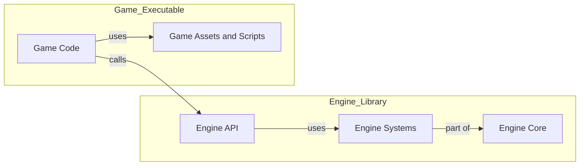
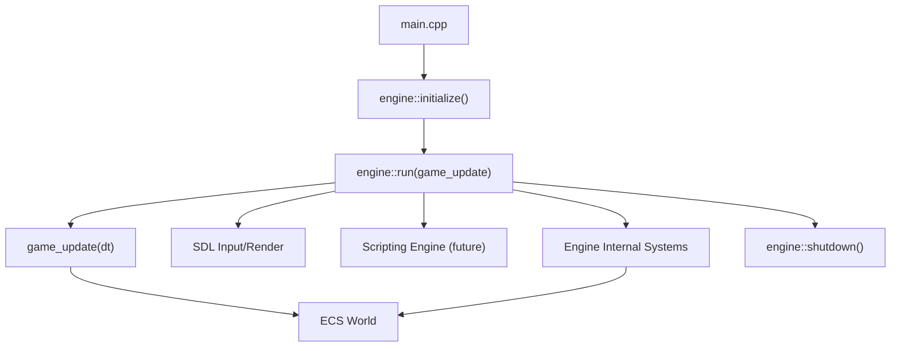
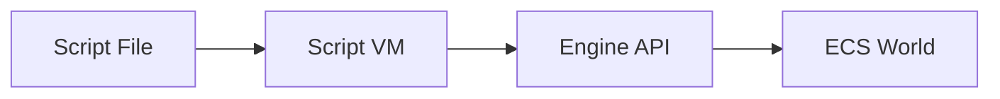
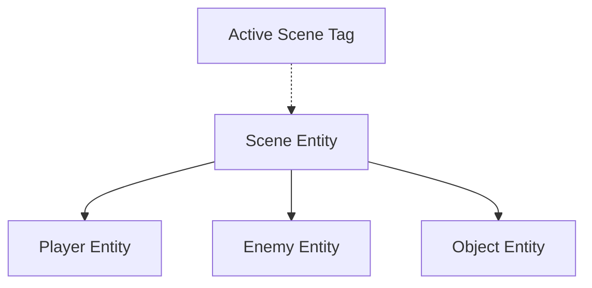

# Engine–Game Separation Architecture Plan  
*SDL + Flecs ECS, Scripting-Ready*

---

## 1. **Project Structure**

A clear directory and module separation between **engine** and **game** code.

```
/engine/                   # Engine core as a library
  ecs/                     # ECS components, systems, queries
  sdl/                     # SDL wrappers & utilities
  scripting/               # Scripting (Lua/Python, future)
  resources/               # Asset/resource management
  core/                    # Engine API, main loop, context
/include/engine/           # Engine public headers

/game/                     # Game-specific code
  scenes/                  # Game scenes, states
  entities/                # Game entity definitions, prefabs
  scripts/                 # Game scripts (for scripting API)
  assets/                  # Game assets

main.cpp                   # Minimal entry point
CMakeLists.txt             # Separate engine & game targets
```

---

## 2. **Build System**

- **Engine** is a static/shared library: `libengine.a` / `engine.dll`
- **Game** is an executable linked to the engine



---

## 3. **Engine–Game API Boundary**

- **Engine exposes:**  
  - ECS world, entity/component API
  - Resource (texture/audio) management
  - Input/event system
  - Scripting API (future)
  - Main loop control

- **Game provides:**  
  - Systems, components (registered with engine)
  - Scenes, game logic, data, assets
  - Scripting code (future, loaded via engine)

---

## 4. **Engine API Example**

```cpp
// engine.h
namespace engine {
    void initialize();
    void shutdown();
    void run(std::function<void(float)> game_update);
    ecs_world_t* get_world();

    // Entity/Component API
    Entity create_entity();
    void add_component(Entity, ...);

    // Resource loading
    Texture load_texture(const std::string& path);

    // Scripting (future)
    void register_script_api(...);
}
```

---

## 5. **Minimal Main Entry**

```cpp
#include <engine/engine.h>
#include "game/game_init.h"

int main() {
    engine::initialize();
    engine::run(game_update); // game_update: your game loop function
    engine::shutdown();
    return 0;
}
```

---

## 6. **Control Flow Diagram**



---

## 7. **Scripting Integration (Future-Proofing)**

- Engine loads and binds scripting VM (Lua/Python/AngelScript).
- Exposes engine API to scripts.
- Game code can be moved to scripts without engine changes.
- Script files live in `/game/scripts/`.



---

## 8. **Advanced ECS Patterns**

- **Event Entities:** SDL input → ECS event entities → game systems.
- **Resource/Singleton Components:** SDL/engine state exposed as ECS singletons.
- **Scene Entities:** Each scene is an ECS entity; scene switching via tags/queries.
- **Prefabs/Templates:** Reusable ECS archetypes for entities.
- **System Scheduling:** Control system frequency/order with Flecs phases.

---

## 9. **Scene Management**

- Each scene is an ECS entity with a `Scene` component.
- Entities belong to scenes via parent/child or tag.
- Only active scene entities are updated/rendered.



---

## 10. **Summary of Benefits**

- **Clear separation:** Engine is reusable, game is modular
- **Scripting-ready:** Add scripting with minimal refactor
- **Testable:** Engine and game can be tested independently
- **Scalable:** Add new games or tools atop the engine

---

## 11. **Next Steps**

1. Scaffold project structure as above
2. Implement engine API and ECS core
3. Create a minimal game using engine API
4. Add event, resource, and scene management patterns
5. Prepare for scripting by designing C API boundaries

---

*For detailed code templates or further diagrams, just ask!*