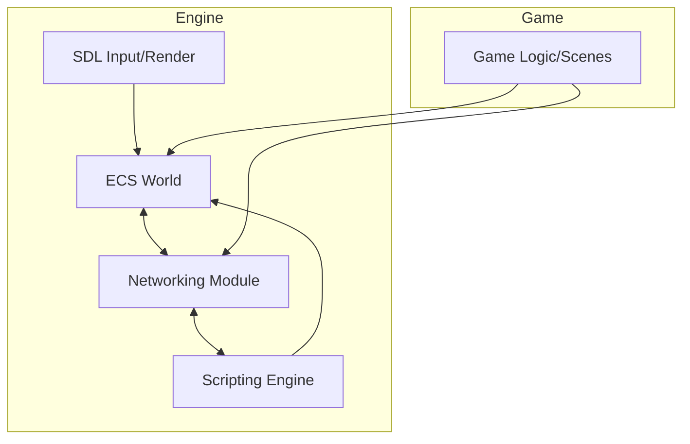
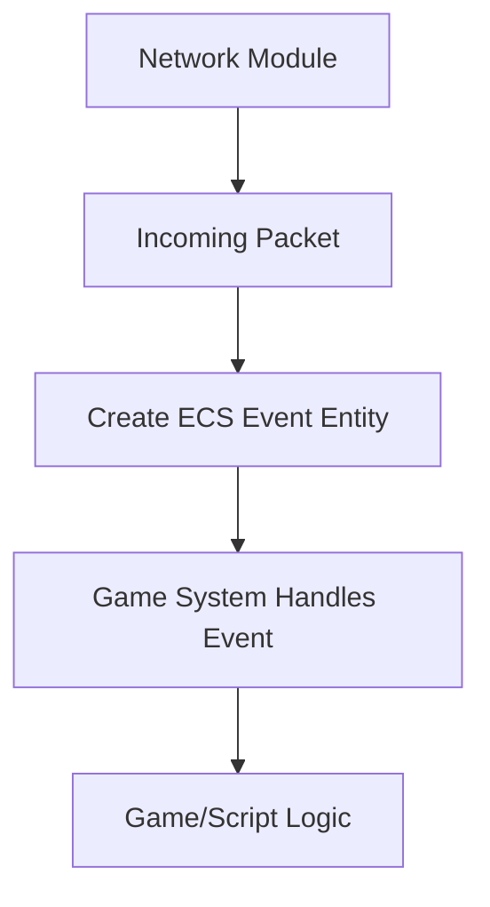

# Extending Engine–Game Architecture: Adding Networking

---

## 1. **Modular Networking Layer**

Add a dedicated `network/` module to the engine:

```
/engine/
  network/            # Networking client/server logic, protocols, serialization
  ecs/
  sdl/
  scripting/
  resources/
  core/
  ...
/include/engine/
  network.h           # Public networking API
```

---

## 2. **Build System Update**

- Networking code is part of the engine library.
- Any third-party dependencies (e.g., ENet, SDL_net, Boost.Asio) are linked in the engine.

---

## 3. **Networking API Surface**

Expose networking features via the engine API, such as:

```cpp
namespace engine {
    namespace net {
        void initialize();
        void shutdown();

        void host_server(int port);
        void connect_to_server(const std::string& ip, int port);
        void send_packet(const void* data, size_t size, int channel = 0);
        void set_packet_handler(std::function<void(const void*, size_t)> handler);

        // For ECS integration:
        void broadcast_ecs_event(Entity event_entity);
        void receive_ecs_event(const void* data, size_t size);
    }
}
```

---

## 4. **Control Flow with Networking**



- **ECS and Networking are decoupled** via events/components.
- **Game logic** can send/receive data via engine networking API.
- **Scripting** has access to networking through engine API.

---

## 5. **Networking and ECS Integration Patterns**

- **Network Events as ECS Entities:**  
  - Incoming packets are translated into ECS event entities (e.g., `NetworkEvent`, `PlayerJoined`, `StateSync`).
  - Outgoing game events/components are serialized and sent over the network.

- **Networked Components:**  
  - Some ECS components are marked as "networked" (e.g., Position, Health).
  - Systems serialize/deserialize these for sync.

- **Prediction and Reconciliation:**  
  - Optional: Use ECS systems for client-side prediction and server reconciliation.

---

## 6. **Scripting and Networking**

- Scripting API exposes networking (send/receive, event hooks).
- Scripts can handle custom network messages or reactions.

---

## 7. **Example: Network Event Flow**



---

## 8. **Summary of Changes**

- **engine/network/**: New networking layer, integrated with ECS and scripting.
- **engine API**: Extended to cover networking.
- **Game code**: Uses engine networking, never touches low-level network code directly.
- **Scripting**: Can access networking features via engine API.

---

## 9. **Next Steps**

1. Implement `engine/network/` module and API.
2. Add ECS components/systems for network events and synchronization.
3. Document networked component registration.
4. Expose networking to scripting layer (future).
5. Write sample multiplayer game logic in `/game/`.

---

*If you need concrete code templates or networking architecture examples, just ask!*