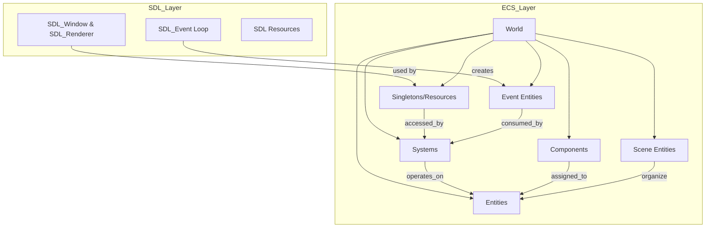
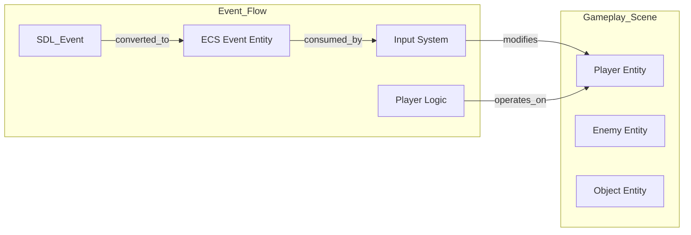

# Game Engine Architecture Plan: SDL + Flecs ECS

This document outlines the structure and implementation plan for an SDL-based game engine using Flecs ECS, leveraging advanced ECS patterns such as event/message systems, resource management, scene/state separation, and system scheduling.

---

## 1. Core Architecture Diagram



---

## 2. Project Structure

```
/engine/
  main.cpp
  ecs/
    components.h
    systems.h
    events.h
    resources.h
    scene.h
  sdl/
    sdl_wrapper.h
    asset_manager.h
  game/
    game_logic.h
    scenes/
      menu_scene.h
      gameplay_scene.h
  CMakeLists.txt
```

---

## 3. Implementation Plan

### Step 1: **Initialize SDL and Flecs**

- Initialize SDL subsystems (video, audio, input).
- Create the Flecs world.
- Register all components and tags.

### Step 2: **Define Components**

- `Position`, `Velocity`, `Sprite`, `Input`, etc.
- Use header `ecs/components.h`.

### Step 3: **Set Up Resource/Singleton Components**

- Store global resources as singletons.
- Example: `RendererResource` with `SDL_Renderer*`.

### Step 4: **Implement Event System**

- Create event components (e.g., `KeyEvent`).
- In SDL event loop, create event entities for ECS systems to consume.

### Step 5: **Create Scenes as ECS Entities**

- Each scene is an entity with a `Scene` component.
- Scene switching: activate/deactivate entities by scene association.

### Step 6: **Write Systems**

- **Logic Systems:** Movement, input, collision, etc.
- **Render System:** Uses SDL to draw, gets renderer from singleton.
- **Event Systems:** Consume and clear event entities each frame.

### Step 7: **Main Game Loop**

- Poll SDL events, create ECS event entities.
- Call `ecs_progress(world, delta_time)`.
- Present renderer.

### Step 8: **Advanced Patterns**

- Use prefabs for templated entities (enemies, projectiles).
- Use tags for simple behavior.
- Use hierarchy for scene graph or parent/child relationships.

### Step 9: **Scene Management**

- Organize entities by scene.
- Only update/render entities in active scene.

### Step 10: **Cleanup**

- Properly destroy SDL resources and ECS world on exit.

---

## 4. Component & System Example

```cpp
// components.h
typedef struct { float x, y; } Position;
typedef struct { float vx, vy; } Velocity;
typedef struct { SDL_Texture* tex; } Sprite;
typedef struct { int key; bool pressed; } KeyEvent;
```

```cpp
// systems.h
void MoveSystem(ecs_iter_t *it) {
    Position *p = ecs_field(it, Position, 1);
    Velocity *v = ecs_field(it, Velocity, 2);
    for (int i = 0; i < it->count; i++) {
        p[i].x += v[i].vx;
        p[i].y += v[i].vy;
    }
}
```

---

## 5. Scene & Event Management Diagram



---

## 6. System Scheduling Example

- **EcsOnUpdate:** Input, logic, movement
- **EcsOnStore:** Rendering
- **EcsOnAdd/Remove:** Triggers for spawning/destroying entities

---

## 7. Recommended Practices

- **Keep SDL-specific code in systems/resources, not components.**
- **Use queries for efficient system operation.**
- **Batch/defer operations for performance.**
- **Write small, focused systems.**
- **Use Flecs’ observers for event-driven logic.**

---

## 8. Example Game Loop

```cpp
while (running) {
    while (SDL_PollEvent(&event)) {
        // Convert SDL events to ECS event entities
    }
    ecs_progress(world, delta_time);
    SDL_RenderPresent(renderer);
}
```

---

# Next Steps

1. Set up project folder structure.
2. Define core components and register them.
3. Implement resource and event systems.
4. Develop main loop with ECS integration.
5. Expand with scenes, prefabs, and advanced ECS patterns.

---

**If you need code templates for any specific part, let me know!**